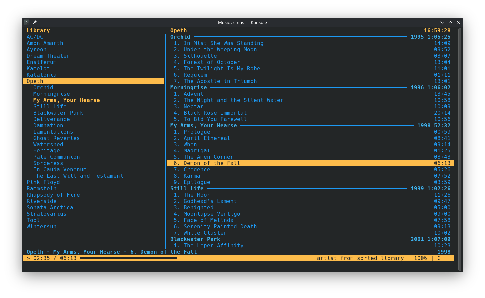

<h2 align="center">Neptune theme 🎨</h2>

A **blue** and **yellow** color theme for cmus, the superb and minimalist terminal audio player.

## Installation

1. Get and copy the file `neptune.theme` to your cmus configuration directory:<br>
   ```wget ```
   `~/.config/cmus/`

2. Start `cmus` and run the following command inside cmus:<br>
   ```:colorscheme neptune.theme```

3. If you want to apply the theme permanently, append the command to your cmus configuration file by executing:<br>
   ```echo 'colorscheme neptune' >> ~/.config/cmus/rc```

## Preview



Disclaimer: Depending on the terminal color palette configuration, the final appearance may vary from the screenshot.